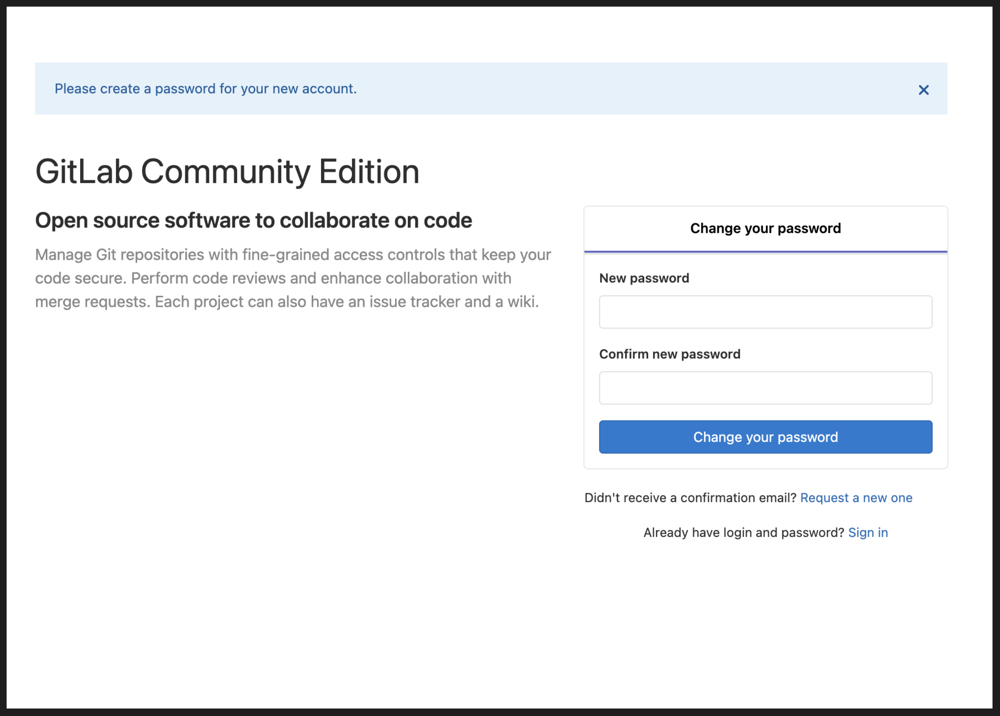

# _Setup_ do ambiente local com Docker

Com o docker rodando em seu computador, execute o comando `docker run --publish 80:80 --publish 22:22 --hostname localhost wlsf82/gitlab-ce` e aguarde até o ambiente inicializar.

> 🕐 Isso por levar alguns minutos.
>
> ☕ Portanto, recomendo pegar um café (ou um chá) enquanto aguarda.
>
> ❗Se você possui um computador com processador M1, utilize a seguinte imagem `yrzr/gitlab-ce-arm64v8`, em vez da imagem `wlsf82/gitlab-ce`.
>
> ⚠️ **Vale lembrar que tal imagem (`yrzr/gitlab-ce-arm64v8`) não é mantida pela Talking About Testing, e portanto, os seletores CSS disponíveis durante as aulas do curso podem não ser os mesmos. Neste caso, você terá que encontrar seletores compatíveis por conta própria.**
>
> Para aprender mais sobre seletores CSS, assista aos vídeos da _playlist_ [Seletores CSS para QAs](https://www.youtube.com/playlist?list=PL-eblSNRj0QHGg3iE2HAtOkzIyNH9DSjL) do Canal TAT no YouTube.
>
> **Além disso, assista a _Live_ [Como corrigir os testes quando a aplicação muda e "quebra" tudo?](https://www.youtube.com/live/d-snu1qKdHk?feature=share), a qual será de grande ajuda. 😉**

Depois de alguns minutos, acesse a URL http://localhost para definir a senha do usuário `root`.

## Definindo a senha do usuário `root`

Ao acessar a URL http://localhost, você deve ver uma página para trocar a senha do usuário `root`, conforme abaixo:

Digite uma senha, confirme a mesma e clique no botão _Change your password_.

> A senha definida aqui será usada na aula 1, portanto, use uma senha que irá se lembrar (ou tome nota).
>
> ❗Se você possui um computador com processador M1 e utilizou a  imagem `yrzr/gitlab-ce-arm64v8`, a senha do usuário `root` já estará definida e você precisará redefiní-la. Para isso, siga os seguintes passos, descritos por um dos alunos do curso:
>
> Antes de tudo, é preciso ter baixado a interface Docker pro Mac.
>
> 1 - No Docker Desktop, vá para o terminal da imagem que você está utilizando (a imagem precisa estar rodando)
> 
> 2 - No terminal, use o comando `gitlab-rake gitlab:password:reset`
> 
> 3 - Depois de alguns segundos, o terminal vai perguntar para qual usuário você deseja trocar a senha, o qual nesse caso, será o `root`
> 
> 4 - O terminal vai pedir para você digitar a nova senha e confirmar. Logo depois, você será informado(a) que a senha foi trocada com sucesso!
>
> Créditos para o Jhuan Magno Pisa Neves. Obrigado!

## Criando um Access Token

1. Faça login com o usuário `root` com a senha definida na seção anterior
2. Clique no avatar do usuário no canto superior direito da tela; clique no link _Settings_, e então; clique na opção _Access Tokens_ (no menu lateral esquerdo)
3. No campo nome, digite o valor `cypress-intermediario-v2`; na seção _Scopes_ marque a opção **api**; e então, clique no botão _Create personal access token_.

> Uma mensagem de que o _token_ foi criado com sucesso deve ser exibida, além do _token_ propriamente dito. **Copie o _token_ clicando no botão à direita do campo e guarde-o para utilizar na aula 1**.

## Adicionando uma chave SSH

1. No terminal de linha de comando, digite o seguinte comando e pressione ENTER `ssh-keygen -t ed25519 -C "root@example.com"`
2. Será solicitado um caminho para salvar a chave. Pressione ENTER para aceitar o caminho padrão
3. Será solicitada uma senha. Pressione ENTER para que a senha não seja necessária
4. Será solicitado que repita a senha. Pressione ENTER novamente para que a senha não seja necessária
5. De novo no terminal de linha de comando, digite o seguinte comando e pressione ENTER para copiar a chave pública recém criada para a área de transferência `pbcopy < ~/.ssh/id_ed25519.pub`
6. Logado na aplicação com o usuário `root`, clique no avatar do usuário no canto superior direito da tela; clique no link _Settings_; e então, clique na opção _SSH Keys_ (no menu lateral esquerdo)
7. Cole sua chave SSH pública no campo key. O campo _Title_ deve ser automaticamente preenchido
8. Por fim, clique no botão _Add key_.

> Você também encontrará instruções sobre como gerar a chave SSH em sistema operacional Windows na própria aplicação em teste (rodando em seu ambiente local com Docker) a partir da seguinte URL http://localhost/help/ssh/README#generating-a-new-ssh-key-pair (**instruções em Inglês**).

___

Ok, o ambiente local está pronto!

Vá para a [aula 1](./1.md) para fazer o _setup_ do projeto de testes com Cypress.
